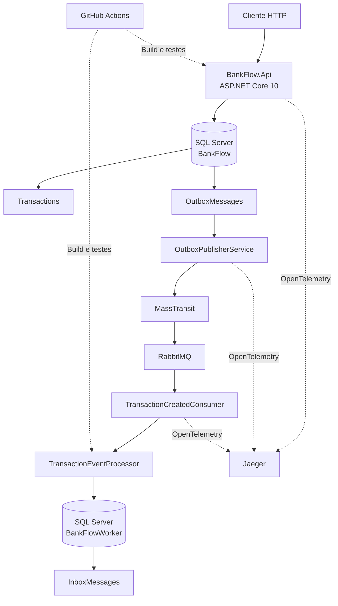

# 🏦 BankFlow

[](https://github.com/andersondom/BankFlow/actions/workflows/ci.yml)


**Sistema demonstrativo de processamento bancário orientado a eventos**, desenvolvido com .NET 10 para explorar arquitetura distribuída, persistência transacional, mensageria assíncrona, idempotência e observabilidade.

O BankFlow demonstra como receber uma transação por HTTP, persistir seus dados e um evento de integração na mesma transação de banco, publicar esse evento no RabbitMQ e processá-lo de forma assíncrona em um serviço independente.

> **Escopo:** projeto educacional e de portfólio. Não representa uma plataforma bancária de produção nem realiza movimentações financeiras reais.

## Arquitetura



A API e o Worker utilizam bancos lógicos distintos no mesmo serviço SQL Server disponibilizado pelo Docker Compose.

### Fluxo de processamento

1. O cliente envia uma transação para `POST /transactions`.
2. A API persiste a transação e o evento correspondente na Outbox, dentro de uma transação de banco de dados.
3. A API responde com `202 Accepted`.
4. O `OutboxPublisherService` consulta eventos pendentes e os publica por meio do MassTransit/RabbitMQ.
5. O `TransactionCreatedConsumer` recebe o evento no Worker.
6. O `TransactionEventProcessor` verifica se o `MessageId` já consta na Inbox.
7. Se a mensagem ainda não tiver sido processada, o Worker registra seu processamento.
8. Mensagens duplicadas são identificadas e ignoradas.

A publicação e o consumo são desacoplados da requisição HTTP. O processamento é assíncrono e admite novas tentativas de entrega.

## Estrutura da solução

| Projeto | Responsabilidade |
|---|---|
| `BankFlow.Api` | API HTTP, persistência de transações e publicação da Outbox |
| `BankFlow.Contracts` | Contratos compartilhados dos eventos |
| `BankFlow.Worker` | Consumo de eventos, Inbox e processamento idempotente |
| `BankFlow.Api.Tests` | Testes automatizados da API |
| `BankFlow.Worker.Tests` | Testes automatizados do Worker |

## Tecnologias

| Tecnologia | Utilização |
|---|---|
| .NET 10 / ASP.NET Core | API REST e serviços de processamento |
| Entity Framework Core 10 | Acesso e persistência de dados |
| SQL Server 2025 Developer | Bancos da API e do Worker |
| MassTransit 8 | Abstração de mensageria |
| RabbitMQ 4 | Transporte de eventos |
| Docker Compose | Orquestração do ambiente local |
| OpenTelemetry | Instrumentação e rastreamento distribuído |
| Jaeger | Consulta e visualização de traces |
| xUnit | Testes automatizados |
| GitHub Actions | Integração contínua |

## Padrões de confiabilidade

### Transactional Outbox

A API grava a transação de negócio e a mensagem da Outbox atomicamente.

Isso evita a situação em que a operação de negócio é persistida, mas seu evento correspondente não é registrado para publicação.

Um serviço em segundo plano busca mensagens pendentes e tenta publicá-las. Após uma publicação bem-sucedida, registra a data de processamento da mensagem.

**Limite importante:** a Outbox não garante entrega exatamente uma vez. Uma falha entre a publicação no broker e a atualização da Outbox pode provocar nova publicação do mesmo evento.

### Inbox e idempotência

O Worker registra os identificadores das mensagens processadas.

Antes de persistir um novo processamento, verifica se o `MessageId` já existe na Inbox. A implementação também trata a possibilidade de uma duplicidade ser detectada durante a gravação.

Esse mecanismo permite ignorar entregas repetidas que preservem o mesmo identificador de mensagem.

### Correlação e tracing distribuído

O fluxo utiliza:

- `CorrelationId`: identificação de negócio para correlacionar a transação e seus eventos.
- `TraceId`: identificação de uma execução distribuída para observabilidade.
- `traceparent` e `tracestate`: propagação do contexto W3C entre serviços.

A API preserva o contexto da requisição na Outbox. Durante a publicação, o contexto é propagado nos headers da mensagem. O Worker recupera esse contexto para continuar o trace.

A continuidade do `TraceId` entre API e Worker foi validada em um teste de ponta a ponta com os serviços executados no Docker.

## Executando com Docker

### Pré-requisitos

- Docker Desktop ou Docker Engine com Docker Compose.
- Portas necessárias disponíveis no computador.

### 1. Configurar as variáveis de ambiente

Crie um arquivo `.env` na raiz do repositório com as seguintes variáveis:

```dotenv
MSSQL_SA_PASSWORD=SUBSTITUA_POR_UMA_SENHA_FORTE
RABBITMQ_DEFAULT_USER=bankflow
RABBITMQ_DEFAULT_PASS=SUBSTITUA_POR_OUTRA_SENHA_FORTE
```

Use senhas próprias, não reutilize credenciais reais e **não versione o arquivo `.env`**.

A senha do SQL Server deve atender aos requisitos de complexidade do produto.

### 2. Iniciar os serviços

```bash
docker compose up -d --build
```

Verifique o estado dos containers:

```bash
docker compose ps
```

O ambiente inclui cinco serviços:

| Serviço | Endereço local |
|---|---|
| API | `http://localhost:5064` |
| SQL Server | `localhost,21433` |
| RabbitMQ (AMQP) | `localhost:5672` |
| RabbitMQ Management | `http://localhost:15672` |
| Jaeger | `http://localhost:16686` |

**Observação:** a porta `21433` é o mapeamento externo do SQL Server. Os containers continuam se comunicando com ele por `sqlserver:1433`.

### 3. Preparar os bancos

O BankFlow utiliza dois bancos lógicos no SQL Server:

| Banco | Projeto | DbContext |
|---|---|---|
| `BankFlow` | `BankFlow.Api` | `BankFlowDbContext` |
| `BankFlowWorker` | `BankFlow.Worker` | `WorkerDbContext` |

O Docker Compose inicia o SQL Server, mas não aplica automaticamente as migrations.

Em uma instalação nova, inicie primeiro as dependências:

```bash
docker compose up -d sqlserver rabbitmq jaeger
docker compose ps
```

Aguarde até que o SQL Server esteja saudável.

No PowerShell, na raiz do repositório, carregue a senha do SQL Server a partir do arquivo `.env`:

```powershell
$envLine = Get-Content .env |
    Where-Object { $_ -match '^MSSQL_SA_PASSWORD=' } |
    Select-Object -First 1

if (-not $envLine) {
    throw "MSSQL_SA_PASSWORD não encontrada no .env."
}

$sqlPassword = $envLine.Substring("MSSQL_SA_PASSWORD=".Length)
```

Configure as connection strings para acesso ao SQL Server pelo Windows:

```powershell
$env:ConnectionStrings__BankFlow = "Server=localhost,21433;Database=BankFlow;User Id=sa;Password=$sqlPassword;TrustServerCertificate=True"

$env:ConnectionStrings__BankFlowWorker = "Server=localhost,21433;Database=BankFlowWorker;User Id=sa;Password=$sqlPassword;TrustServerCertificate=True"
```

Com o SDK .NET 10 e a ferramenta `dotnet-ef` disponíveis, aplique as migrations:

```powershell
dotnet ef database update --project src/BankFlow.Api --startup-project src/BankFlow.Api --context BankFlowDbContext

dotnet ef database update --project src/BankFlow.Worker --startup-project src/BankFlow.Worker --context WorkerDbContext
```

**Observação:** os comandos acima pressupõem que os projetos conseguem criar seus respectivos DbContexts em tempo de design. Caso isso não ocorra, será necessário ajustar a configuração de design-time.

Após a aplicação bem-sucedida das migrations, inicie os serviços da aplicação:

```bash
docker compose up -d api worker
```

Não publique o arquivo `.env` nem exponha credenciais em logs ou capturas de tela.

### 4. Verificar a API

Com o ambiente inicializado e os bancos preparados:

```bash
curl http://localhost:5064/
```

Para consultar o health check:

```bash
curl http://localhost:5064/health
```

O endpoint `/health` verifica a conectividade da API com seu banco de dados.

### 5. Criar uma transação

Exemplo com PowerShell:

```powershell
$body = @{
    amount = 325.50
    type = 1
} | ConvertTo-Json

Invoke-RestMethod `
    -Method Post `
    -Uri "http://localhost:5064/transactions" `
    -ContentType "application/json" `
    -Body $body
```

Uma requisição aceita retorna HTTP `202 Accepted`. O processamento do evento acontece posteriormente no Worker.

### 6. Consultar os logs

```bash
docker compose logs api --tail 100
docker compose logs worker --tail 100
```

Para acompanhar continuamente:

```bash
docker compose logs -f api worker
```

### 7. Visualizar traces

Acesse:

**http://localhost:16686**

No Jaeger, consulte os traces produzidos pela API e pelo Worker. Os spans instrumentados permitem acompanhar a publicação e o processamento dos eventos.

### 8. Encerrar o ambiente

```bash
docker compose down
```

Esse comando remove os containers e a rede criada pelo Compose, preservando os volumes nomeados.

> **Atenção:** `docker compose down -v` também remove os volumes associados ao projeto e pode causar perda dos dados persistidos.

## Executando os testes

Na raiz do repositório:

```bash
dotnet restore BankFlow.slnx

dotnet build BankFlow.slnx --configuration Release --no-restore

dotnet test BankFlow.slnx --configuration Release --no-build --no-restore
```

Na última validação local, os **8 testes automatizados foram aprovados**.

## Integração contínua

O workflow `.github/workflows/ci.yml` executa automaticamente:

1. Checkout do repositório.
2. Instalação do SDK .NET 10.
3. Restauração das dependências.
4. Compilação em modo Release.
5. Execução dos testes automatizados.
6. Publicação dos resultados de teste como artefatos.

O pipeline é acionado em pushes e pull requests para a branch `main`, além de permitir execução manual.

**[Consultar as execuções do BankFlow CI](https://github.com/andersondom/BankFlow/actions/workflows/ci.yml)**

## Limitações e evolução

O BankFlow demonstra padrões importantes de sistemas distribuídos, mas ainda há diferenças em relação a uma solução bancária de produção.

Entre as possíveis evoluções estão:

- Políticas operacionais mais completas para mensagens com falhas persistentes.
- Métricas exportadas para uma plataforma de monitoramento.
- Testes de integração automatizados com infraestrutura real.
- Autenticação, autorização e políticas de segurança adequadas a dados financeiros.
- Estratégias de concorrência, auditoria e recuperação de desastres.

## Autor

**Anderson Domingos**

Desenvolvedor .NET • Instrutor de Tecnologia • Gestão de Projetos

GitHub: [@andersondom](https://github.com/andersondom)

---

Projeto desenvolvido para estudo e demonstração de arquitetura distribuída, mensageria e boas práticas de engenharia de software.
